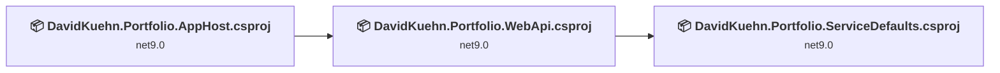
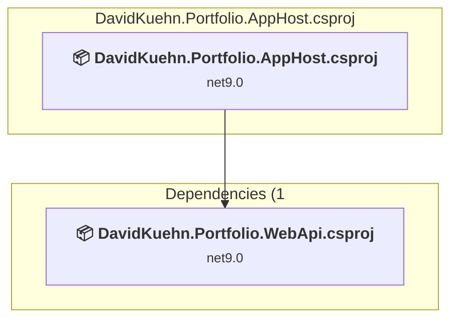
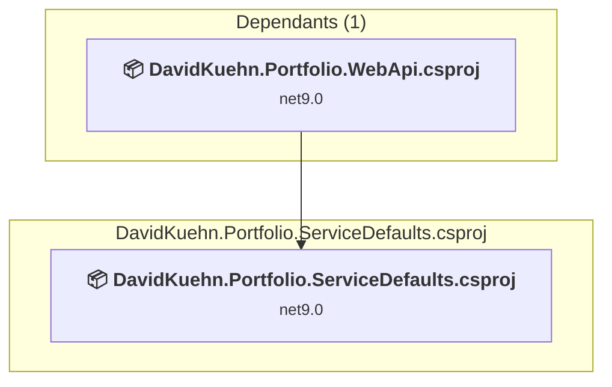
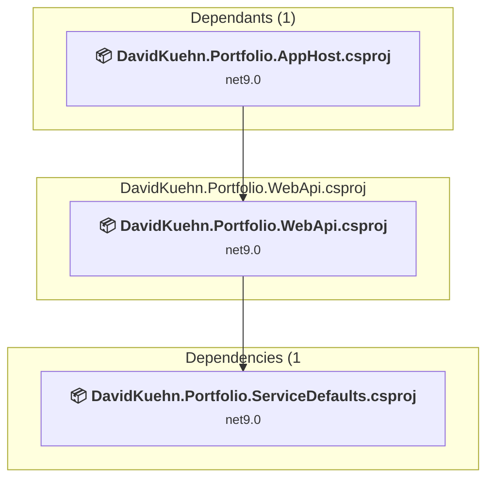

# Projects and dependencies analysis

This document provides a comprehensive overview of the projects and their dependencies in the context of upgrading to .NETCoreApp,Version=v10.0.

## Table of Contents

- [Executive Summary](#executive-Summary)
  - [Highlevel Metrics](#highlevel-metrics)
  - [Projects Compatibility](#projects-compatibility)
  - [Package Compatibility](#package-compatibility)
  - [API Compatibility](#api-compatibility)
- [Aggregate NuGet packages details](#aggregate-nuget-packages-details)
- [Top API Migration Challenges](#top-api-migration-challenges)
  - [Technologies and Features](#technologies-and-features)
  - [Most Frequent API Issues](#most-frequent-api-issues)
- [Projects Relationship Graph](#projects-relationship-graph)
- [Project Details](#project-details)

  - [DavidKuehn.Portfolio.AppHost\DavidKuehn.Portfolio.AppHost.csproj](#davidkuehnportfolioapphostdavidkuehnportfolioapphostcsproj)
  - [DavidKuehn.Portfolio.ServiceDefaults\DavidKuehn.Portfolio.ServiceDefaults.csproj](#davidkuehnportfolioservicedefaultsdavidkuehnportfolioservicedefaultscsproj)
  - [DavidKuehn.Portfolio.WebApi\DavidKuehn.Portfolio.WebApi.csproj](#davidkuehnportfoliowebapidavidkuehnportfoliowebapicsproj)

## Executive Summary

### Highlevel Metrics

| Metric | Count | Status |
| :--- | :---: | :--- |
| Total Projects | 3 | All require upgrade |
| Total NuGet Packages | 10 | 7 need upgrade |
| Total Code Files | 10 |  |
| Total Code Files with Incidents | 4 |  |
| Total Lines of Code | 338 |  |
| Total Number of Issues | 17 |  |
| Estimated LOC to modify | 6+ | at least 1.8% of codebase |

### Projects Compatibility

| Project | Target Framework | Difficulty | Package Issues | API Issues | Est. LOC Impact | Description |
| :--- | :---: | :---: | :---: | :---: | :---: | :--- |
| [DavidKuehn.Portfolio.AppHost\DavidKuehn.Portfolio.AppHost.csproj](#davidkuehnportfolioapphostdavidkuehnportfolioapphostcsproj) | net9.0 | 🟢 Low | 2 | 0 |  | DotNetCoreApp, Sdk Style = True |
| [DavidKuehn.Portfolio.ServiceDefaults\DavidKuehn.Portfolio.ServiceDefaults.csproj](#davidkuehnportfolioservicedefaultsdavidkuehnportfolioservicedefaultscsproj) | net9.0 | 🟢 Low | 4 | 0 |  | ClassLibrary, Sdk Style = True |
| [DavidKuehn.Portfolio.WebApi\DavidKuehn.Portfolio.WebApi.csproj](#davidkuehnportfoliowebapidavidkuehnportfoliowebapicsproj) | net9.0 | 🟢 Low | 2 | 6 | 6+ | AspNetCore, Sdk Style = True |

### Package Compatibility

| Status | Count | Percentage |
| :--- | :---: | :---: |
| ✅ Compatible | 3 | 30.0% |
| ⚠️ Incompatible | 0 | 0.0% |
| 🔄 Upgrade Recommended | 7 | 70.0% |
| ***Total NuGet Packages*** | ***10*** | ***100%*** |

### API Compatibility

| Category | Count | Impact |
| :--- | :---: | :--- |
| 🔴 Binary Incompatible | 0 | High - Require code changes |
| 🟡 Source Incompatible | 6 | Medium - Needs re-compilation and potential conflicting API error fixing |
| 🔵 Behavioral change | 0 | Low - Behavioral changes that may require testing at runtime |
| ✅ Compatible | 343 |  |
| ***Total APIs Analyzed*** | ***349*** |  |

## Aggregate NuGet packages details

| Package | Current Version | Suggested Version | Projects | Description |
| :--- | :---: | :---: | :--- | :--- |
| Aspire.Hosting.AppHost | 9.5.1 | 13.1.0 | [DavidKuehn.Portfolio.AppHost.csproj](#davidkuehnportfolioapphostdavidkuehnportfolioapphostcsproj) | NuGet package upgrade is recommended |
| Microsoft.AspNetCore.Authentication.JwtBearer | 9.0.8 | 10.0.2 | [DavidKuehn.Portfolio.WebApi.csproj](#davidkuehnportfoliowebapidavidkuehnportfoliowebapicsproj) | NuGet package upgrade is recommended |
| Microsoft.AspNetCore.OpenApi | 9.0.9 | 10.0.2 | [DavidKuehn.Portfolio.WebApi.csproj](#davidkuehnportfoliowebapidavidkuehnportfoliowebapicsproj) | NuGet package upgrade is recommended |
| Microsoft.Extensions.Http.Resilience | 8.10.0 | 10.2.0 | [DavidKuehn.Portfolio.ServiceDefaults.csproj](#davidkuehnportfolioservicedefaultsdavidkuehnportfolioservicedefaultscsproj) | NuGet package upgrade is recommended |
| Microsoft.Extensions.ServiceDiscovery | 9.5.1 | 10.2.0 | [DavidKuehn.Portfolio.ServiceDefaults.csproj](#davidkuehnportfolioservicedefaultsdavidkuehnportfolioservicedefaultscsproj) | NuGet package upgrade is recommended |
| OpenTelemetry.Exporter.OpenTelemetryProtocol | 1.9.0 |  | [DavidKuehn.Portfolio.ServiceDefaults.csproj](#davidkuehnportfolioservicedefaultsdavidkuehnportfolioservicedefaultscsproj) | ✅Compatible |
| OpenTelemetry.Extensions.Hosting | 1.9.0 |  | [DavidKuehn.Portfolio.ServiceDefaults.csproj](#davidkuehnportfolioservicedefaultsdavidkuehnportfolioservicedefaultscsproj) | ✅Compatible |
| OpenTelemetry.Instrumentation.AspNetCore | 1.9.0 | 1.15.0 | [DavidKuehn.Portfolio.ServiceDefaults.csproj](#davidkuehnportfolioservicedefaultsdavidkuehnportfolioservicedefaultscsproj) | NuGet package upgrade is recommended |
| OpenTelemetry.Instrumentation.Http | 1.9.0 | 1.15.0 | [DavidKuehn.Portfolio.ServiceDefaults.csproj](#davidkuehnportfolioservicedefaultsdavidkuehnportfolioservicedefaultscsproj) | NuGet package upgrade is recommended |
| OpenTelemetry.Instrumentation.Runtime | 1.9.0 |  | [DavidKuehn.Portfolio.ServiceDefaults.csproj](#davidkuehnportfolioservicedefaultsdavidkuehnportfolioservicedefaultscsproj) | ✅Compatible |

## Top API Migration Challenges

### Technologies and Features

| Technology | Issues | Percentage | Migration Path |
| :--- | :---: | :---: | :--- |

### Most Frequent API Issues

| API | Count | Percentage | Category |
| :--- | :---: | :---: | :--- |
| T:Microsoft.AspNetCore.Authentication.JwtBearer.JwtBearerDefaults | 2 | 33.3% | Source Incompatible |
| F:Microsoft.AspNetCore.Authentication.JwtBearer.JwtBearerDefaults.AuthenticationScheme | 2 | 33.3% | Source Incompatible |
| T:Microsoft.Extensions.DependencyInjection.JwtBearerExtensions | 1 | 16.7% | Source Incompatible |
| M:Microsoft.Extensions.DependencyInjection.JwtBearerExtensions.AddJwtBearer(Microsoft.AspNetCore.Authentication.AuthenticationBuilder) | 1 | 16.7% | Source Incompatible |

## Projects Relationship Graph

Legend:
📦 SDK-style project
⚙️ Classic project

## Project Details

### DavidKuehn.Portfolio.AppHost\DavidKuehn.Portfolio.AppHost.csproj

#### Project Info

- **Current Target Framework:** net9.0
- **Proposed Target Framework:** net10.0
- **SDK-style**: True
- **Project Kind:** DotNetCoreApp
- **Dependencies**: 1
- **Dependants**: 0
- **Number of Files**: 1
- **Number of Files with Incidents**: 1
- **Lines of Code**: 16
- **Estimated LOC to modify**: 0+ (at least 0.0% of the project)

#### Dependency Graph

Legend:
📦 SDK-style project
⚙️ Classic project

### API Compatibility

| Category | Count | Impact |
| :--- | :---: | :--- |
| 🔴 Binary Incompatible | 0 | High - Require code changes |
| 🟡 Source Incompatible | 0 | Medium - Needs re-compilation and potential conflicting API error fixing |
| 🔵 Behavioral change | 0 | Low - Behavioral changes that may require testing at runtime |
| ✅ Compatible | 28 |  |
| ***Total APIs Analyzed*** | ***28*** |  |

### DavidKuehn.Portfolio.ServiceDefaults\DavidKuehn.Portfolio.ServiceDefaults.csproj

#### Project Info

- **Current Target Framework:** net9.0
- **Proposed Target Framework:** net10.0
- **SDK-style**: True
- **Project Kind:** ClassLibrary
- **Dependencies**: 0
- **Dependants**: 1
- **Number of Files**: 1
- **Number of Files with Incidents**: 1
- **Lines of Code**: 119
- **Estimated LOC to modify**: 0+ (at least 0.0% of the project)

#### Dependency Graph

Legend:
📦 SDK-style project
⚙️ Classic project

### API Compatibility

| Category | Count | Impact |
| :--- | :---: | :--- |
| 🔴 Binary Incompatible | 0 | High - Require code changes |
| 🟡 Source Incompatible | 0 | Medium - Needs re-compilation and potential conflicting API error fixing |
| 🔵 Behavioral change | 0 | Low - Behavioral changes that may require testing at runtime |
| ✅ Compatible | 102 |  |
| ***Total APIs Analyzed*** | ***102*** |  |

### DavidKuehn.Portfolio.WebApi\DavidKuehn.Portfolio.WebApi.csproj

#### Project Info

- **Current Target Framework:** net9.0
- **Proposed Target Framework:** net10.0
- **SDK-style**: True
- **Project Kind:** AspNetCore
- **Dependencies**: 1
- **Dependants**: 1
- **Number of Files**: 10
- **Number of Files with Incidents**: 2
- **Lines of Code**: 203
- **Estimated LOC to modify**: 6+ (at least 3.0% of the project)

#### Dependency Graph

Legend:
📦 SDK-style project
⚙️ Classic project

### API Compatibility

| Category | Count | Impact |
| :--- | :---: | :--- |
| 🔴 Binary Incompatible | 0 | High - Require code changes |
| 🟡 Source Incompatible | 6 | Medium - Needs re-compilation and potential conflicting API error fixing |
| 🔵 Behavioral change | 0 | Low - Behavioral changes that may require testing at runtime |
| ✅ Compatible | 213 |  |
| ***Total APIs Analyzed*** | ***219*** |  |

